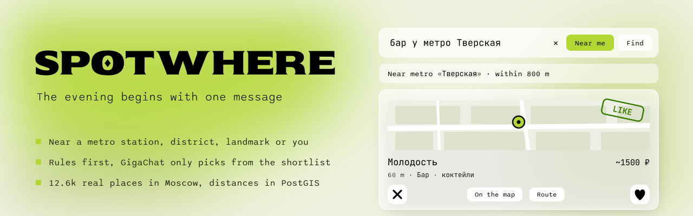
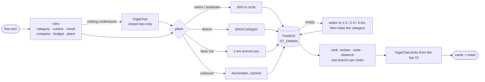

<p align="center">
  <picture>
    <source media="(prefers-color-scheme: dark)" srcset="docs/assets/banner-dark.svg">
    <source media="(prefers-color-scheme: light)" srcset="docs/assets/banner-light.svg">
    
  </picture>
</p>

<p align="center">
  <b>Tell it where you want to go, in plain words, and swipe through real places nearby.</b><br>
  A Telegram Mini App for Moscow: 12.6k venues, searched around the metro station, district, landmark or spot you are at.
</p>

<p align="center">
  <a href="#quick-start"></a>
  <a href="#how-search-works"></a>
  <a href="#api"></a>
</p>

<p align="center">
  <a href="https://github.com/savikthk/Spotwhere-/actions/workflows/ci.yml"></a>
  
  
  
  
  
  
</p>

<p align="center">
  <a href="#what-it-does"><b>What&nbsp;it&nbsp;does</b></a> ·
  <a href="#how-search-works"><b>How&nbsp;search&nbsp;works</b></a> ·
  <a href="#quick-start"><b>Quick&nbsp;start</b></a> ·
  <a href="#api"><b>API</b></a> ·
  <a href="#data"><b>Data</b></a> ·
  <a href="#roadmap"><b>Roadmap</b></a>
</p>

## What it does

You write the way you'd text a friend, Spotwhere works out what kind of place you want and where, finds real venues around that point and shows them as a deck of cards: swipe right to like, left to skip, every swipe tunes your taste.

| You type | What happens |
|---|---|
| `бар у метро Тверская` | bars 62–130 m from the station, nearest first |
| `ресторан у Большого театра` | the landmark is found offline, restaurants from 109 m |
| `кафе на Арбате` | cafés inside the real border of the Arbat district |
| `суши у Китай-города` | sushi places around the station |
| `боулинг с друзьями у Тверской` | nothing within 800 m, so the search widens to 2.5 km and says so |
| `кофейня рядом` + **Near me** | coffee within 1 km of you, 34 m to the nearest |
| `бар у Несуществующего моста` | "Couldn't find it on the map", then the whole city, never a silent guess |
| `спортивный бар` | a sports bar, not the «Спортивная» station |

Every card shows the distance and the line above the deck explains where the search went: *Near metro «Тверская» · within 800 m*.

## How search works

The algorithm does the work. The language model fills gaps and picks from a ready shortlist, and the app keeps working when it is down.



- **Rules first.** A vocabulary of categories, cuisines, moods, company, features and budgets (`до 1500`, `5к`, `недорого`) plus an offline gazetteer from OpenStreetMap: 240 metro stations, 667 landmarks (theatres, museums, parks, squares) and 132 district polygons. Russian word forms match by stems, so `у Чистых прудов` finds «Чистые пруды». A one-word name needs a place cue (`у`, `возле`, `метро`, `в районе`), which keeps `спортивный бар` a sports bar.
- **The language model is narrow.** GigaChat is called only when the rules understood nothing or a place stayed unresolved, its answer is checked against closed lists, and it can reorder the top 10 candidates the algorithm found but never add new ones. After a network failure it is paused for two minutes and every request is answered by the algorithm alone.
- **Location that means something.** Distances come from PostGIS (`geography` with a GiST index). When nothing fits, the radius grows step by step before the category is relaxed, and the response says what happened in `notes`.
- **It learns you.** Likes and dislikes nudge per-tag weights, capped at ±2.

## Quick start

Requirements: Node 24 and Docker Desktop. A **GigaChat** key from developers.sber.ru is optional, without it the app runs on rules alone.

```bash
git clone https://github.com/savikthk/Spotwhere-.git
cd Spotwhere-

cp .env.example .env              # GIGACHAT_KEY is optional
docker compose up -d --build      # PostgreSQL 16 + PostGIS on localhost:5433

cd backend
npm ci
npm run db:load                   # venues.json + data/places.json into the database
npm start                         # http://localhost:8080
```

<details>
<summary><b>Open it inside Telegram</b></summary>

Telegram serves Mini Apps over HTTPS only, so expose the local server through a tunnel:

```bash
cloudflared tunnel --url http://localhost:8080
```

Copy the `https://…trycloudflare.com` URL → **@BotFather → /mybots → your bot → Bot Settings → Menu Button** → paste it. Open the bot and tap the menu button. **Near me** asks Telegram for your location (Bot API 8.0 LocationManager); in a regular browser it falls back to browser geolocation.

> The free tunnel changes its URL on every restart, update it in BotFather each time.

</details>

## API

| Method | Path | Body | Description |
|--------|------|------|-------------|
| GET | `/health` | | health check |
| POST | `/recommend` | `{text, user_id?, lat?, lon?}` | recommend venues; `lat` and `lon` only together |
| POST | `/like` | `{user_id, venue_id}` | like, updates taste |
| POST | `/dislike` | `{user_id, venue_id}` | dislike, updates taste |

Invalid input gets `400 {"error": "validation_failed"}`, an unknown venue `404 {"error": "venue_not_found"}`.

<details>
<summary><b>Example request and response</b></summary>

```bash
curl -X POST localhost:8080/recommend \
  -H 'Content-Type: application/json' \
  -d '{"text": "бар у метро Тверская", "user_id": 1}'
```

```json
{
  "query": { "category": "бар", "cuisines": [], "mood": null, "company": null, "features": [], "budget_max": null, "location": "Тверская" },
  "interpreted_by": "rules",
  "ranked_by": "algorithm",
  "place": { "kind": "metro", "name": "Тверская", "lat": 55.764895, "lon": 37.606313, "radius_m": 800 },
  "notes": [],
  "results": [
    {
      "id": 1212,
      "name": "Молодость",
      "description": "Бар",
      "address": "",
      "tags": ["бар", "коктейли", "шумно", "компания"],
      "avg_bill": 1500,
      "lat": 55.7654, "lon": 37.6059,
      "maps_url": "https://yandex.ru/maps/?text=...",
      "distance_m": 62,
      "matched": []
    }
  ]
}
```

- `place.kind` is `metro`, `landmark`, `district`, `user` or `geocoded`; `radius_m` is `null` for a district.
- `notes` explain the search: `place_not_found`, `radius_expanded`, `area_expanded`, `filters_relaxed`, `outside_city`, `location_needed`.
- `interpreted_by` is `rules` or `rules+llm`, `ranked_by` is `algorithm` or `llm`.

</details>

## Data

Venues come from OpenStreetMap through Overpass, places for the gazetteer too.

```bash
pip install -r requirements.txt
python fetch_venues.py            # venues → venues.json
python enrich_venues.py           # vibe tags via GigaChat (optional)

cd backend
npm run places:fetch              # metro stations, landmarks, districts → data/places.json (committed)
npm run db:load                   # everything into PostgreSQL in one transaction
```

<details>
<summary><b>Project structure</b></summary>

```
backend/            TypeScript backend: REST API + serves the Mini App
  src/domain/       rules: vocabulary, query parser and gazetteer, ranking
  src/services/     search, taste, cached geocoding
  src/repositories/ SQL only, PostGIS queries
  src/llm/          GigaChat adapter: interpret, pick, outage pause
  src/geocoding/    Nominatim fallback
  migrations/       SQL migrations, applied on start
  scripts/          places:fetch and db:load
  data/places.json  metro stations, landmarks and district polygons
db/Dockerfile       PostgreSQL 16 with PostGIS, native on Apple Silicon
frontend/           Telegram Mini App (static)
docs/assets/        README banners
fetch_venues.py     venues from OpenStreetMap → venues.json
enrich_venues.py    vibe tags via GigaChat
```

</details>

<details>
<summary><b>Tests and CI</b></summary>

```bash
cd backend
npm run lint                      # Prettier
npm run typecheck                 # TypeScript, strict
npm test                          # 84 unit and integration tests, the latter on a real PostGIS
```

CI runs the same steps on every pull request with a PostGIS service container, checks the Mini App script and compiles the Python pipeline.

</details>

## Roadmap

- [x] Real venue data from OpenStreetMap
- [x] Search in PostGIS around metro stations, landmarks, districts and your location
- [x] Rules first, GigaChat only for gaps and for picking from a shortlist
- [x] Taste from likes and dislikes
- [ ] Opening hours from OSM and an "open now" filter
- [ ] Real vibe tags, addresses and price levels instead of per-category defaults
- [ ] Chains grouped by OSM brand
- [ ] initData validation (HMAC) for a trusted user id
- [ ] Hosting instead of a temporary tunnel

<sub>Map data © OpenStreetMap contributors, available under the Open Database License. Banner type set in Sekuya, Sono and JetBrains Mono (SIL Open Font License).</sub>
